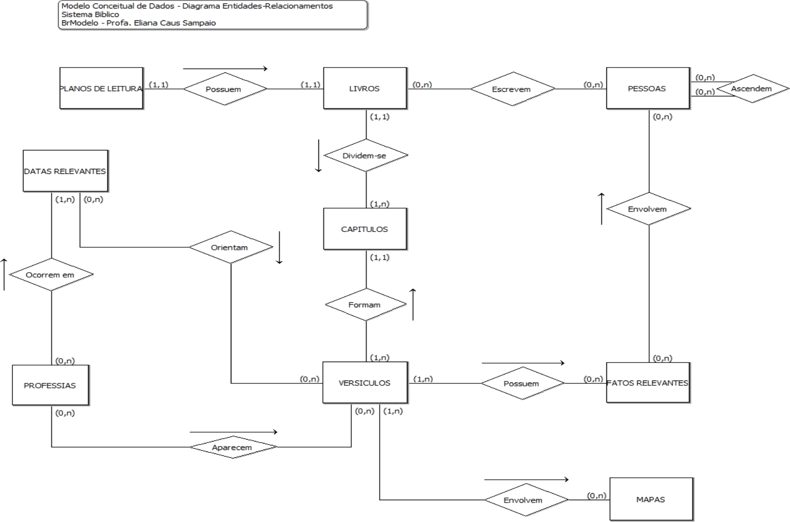
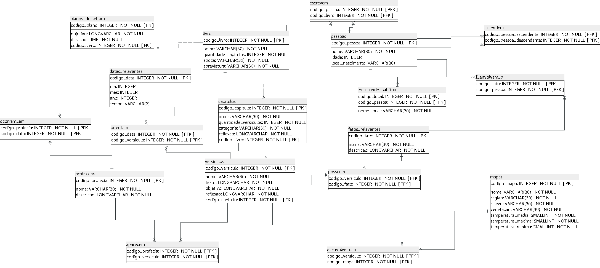

# Trabalho Final de Design e Desenvolvimento de Banco de Dados I
## Modelagem e Normalização - Sistema Bíblico
#### Alunos:
* Bernado Emerick Abaurre
* Guilherme Tozzi Mafra
* José Luiz Dantas Júnior
* Lucas Bertolino Santos Costa
* Lucas Haruo Kikudome
* Paulo Victor Rangel da Silva Cruz

### Professor: Abrantes Araújo Silva Filho
### Monitora: Suellen Miranda Amorim

---
## Introdução
O objetivo deste trabalho é treinar a aplicação de regras de normalização e boas práticas de modelagem de bancos de dados, durante a elaboração de um projeto lógico a partir de um projeto conceitual previamente definido. O projeto com qual o nosso grupo ficou foi o de sistema bíblico. Além do mais, foi necessário criar um script em um Sistema de Gerenciamento de Banco de Dados (SGBD) desse projeto lógico.

### *Obervação: O sistema deste trabalho esta em Postgres, ou seja, não funcionará em outros SQLs .*

### Projeto usado no trabalho:
A imagem em baixo é o projeto que foi usado para desenvolver o trabalho.

### Projeto Lógico / Script:
A figura abaixo mostra o projeto lógico desenvolvido por nosso grupo. Para implementá-lo no PostgreSQL.

**Andamento do projeto:** Este projeto, foi necessário usar a 1º Forma normal até a 3º Forma Normal, essa forma normal seria como um método para deixar o sistema com consistência de dados , ou seja , menos chance de repetir os dado ,com isso o custo seria de deixar o trabalho mais complexo e maior . 

Posto isso , porque nós fazemos todo este trabalho por simples dados repetidos , não seria melhor deixar eles sem essas formas normais ? 

Essa resposta dependeria para qual o tamanho da organização : se for para uma grande empresa com centenas de milhares de informações onde existe outras milhares de dados que seriam a mesma coisa, a forma normal seria uma altenativa para uma maior eficiêcia dos dados neste tipo de caso, já pequenas empresa como botecos, bares, mercadinhos do seu José e entre outros o recomendado seria fazer um banco de dados mais simples , pois, eles não necessitam de complexas consulta com 300 métodos para fazer um super bancos de dados e sim o foco deles é a rapidez com que se faz uma consulta no banco de dados além de possuir poucos cetenas de dados armazenados.

Então depois de toda essa conversa ... qual seria a menor Forma normal comerciável ?

Seria a 3º Forma Normal o qual este trabalho foi feito.

Tanta discussão sobre forma normal aqui e para lá , qual a maior forma normal possível?

Teoricamente seria a 5º Forma Normal , mas como um projeto desta maguinetude seria estremamente complexo e muito dificil , para se ter uma ideia usando este trabalho

